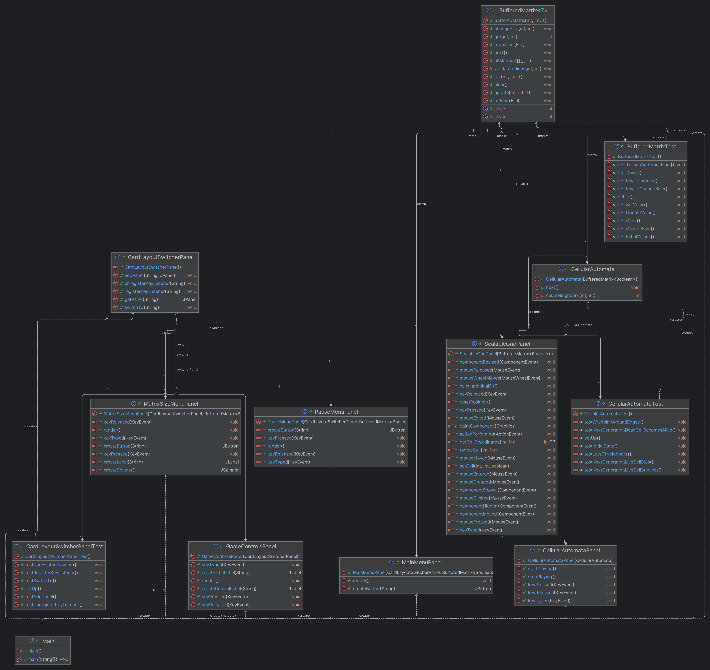

# The Game of Life - README

## Üdvözlünk a *The Game of Life* projektben

Ez a README tartalmazza azokat az alapvető információkat és linkeket, amelyek segítséget nyújtanak a projekt megértéséhez és használatához. A *The Game of Life* egy egyszerű, mégis lenyűgöző szimuláció, amely Conway híres sejtautomata-játékán alapul.

---

## Hivatkozások

1. **Specifikáció**  
   A játék technikai követelményei és részletes működési leírása:  
   [Specifikáció](./specification/compiled-specification.pdf)

2. **Dokumentáció**  
   A fejlesztési folyamat részletei, kódstruktúra dokumentációk:  
   [Dokumentáció](./documentation/compiled-documentation.pdf)

3. **Felhasználói kézikönyv**  
   Lépésről lépésre szóló útmutató, amely segít a játék használatában:  
   [Felhasználói kézikönyv](./documentation/compiled-user-manual.pdf)

4. **UML Gráf**
   

---
